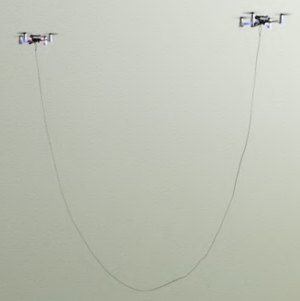
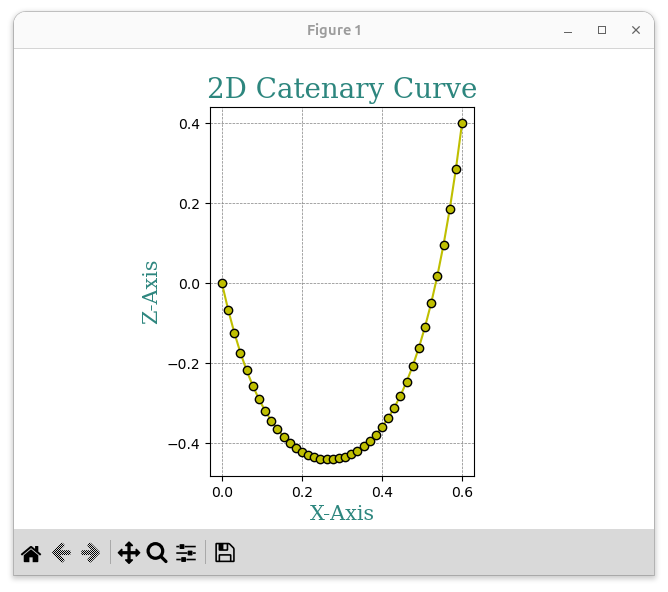
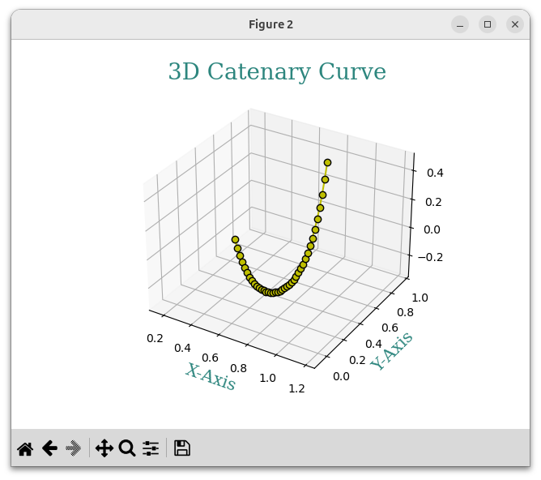

A rope suspended between two mounting points follows a [catenary curve](https://en.wikipedia.org/wiki/Catenary). This principle finds application in robotics, in scenarios containing hanging ropes, where the mounting points can be drones and robotic arms.

The python scripts of this repo contain two functions that create a 2D and a 3D catenary curve.
Catenary_2D output | Catenary_3D output
:---------------------------------:|:---------------------------------:
 | 

# Functions
## Catenary_2D
Catenary_2D(L, dx, dz) creates a catenary curve on x-z plan, placing the reference mounting point on (0,0).

| Variable | Description |
| :---: | :--- |
| L | The length of the rope |
| dx | The horizontal distance of the 2 mounting points |
| dz | The vertical distance of the 2 mounting points |

## Catenary_3D
Catenary_3D(x1,y1,z1,f) generalizes the catenary created by Catenary_2d into three-dimensional space. This is why the position of the reference mounting point is needed as well as the rotation of the curve around the z-axis.

| Variable | Description |
| :---: | :--- |
| x1 | Reference mounting point position on x-axis |
| y1 | Reference mounting point position on y-axis |
| z1 | Reference mounting point position on z-axis |
| f | Rotation of the curve on around z-axis in radians |

# Explanation +3D transformation
The method is a little bit different than the one used for determining parameters [here](https://en.wikipedia.org/wiki/Catenary#Determining_parameters).

The local coordinate system's origin lies on the reference mounting point, its x-axis is parallel to the ground facing along the curve plane and its z-axis is perpendicular to the ground.

# Acknowledgement
